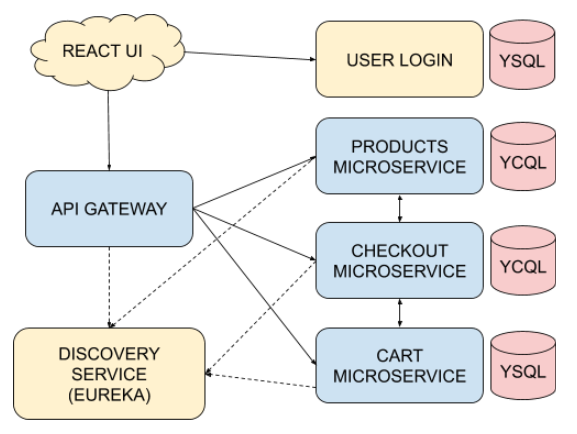

# Yugastore in Java


This is an implementation of a sample ecommerce app. This microservices-based retail marketplace or eCommerce app is composed of microservices written in Java (Spring), a GUI based on React and YugabyteDB as the distributed SQL database.

If you're using this demo app, please :star: this repository! We appreciate your support.

## Trying it out

This repo contains all the instructions you need to [run the app on your laptop](#building-the-app).

You can also [try the app out](https://yugastore-ui.cfapps.io/) online, it is hosted on [Pivotal Web Services](https://run.pivotal.io/).

## Versions

* Java 17
* Spring Boot 2.6.3
* Spring Cloud 2021.0.0
* Yugabyte Java Driver 4.6.0-yb-10
* Python 3 (for data Loading)

## Features

* Written fully in Spring Framework
* Desgined for multi-region and Kubernetes-native deployments
* Features 6 Spring Boot microservices
* Uses a discovery service that the microservices register with
* Sample data has over 6K products in the store

## Architecture

The architecture diagram of Yugastore is shown below.




| Microservice         | YugabyteDB API | Default host:port | Description           |
| -------------------- | ---------------- | ---------------- | --------------------- |
| [service discovery](https://github.com/yugabyte/yugastore-java/tree/master/eureka-server-local) | - | [localhost:8761](http://localhost:8761) | Uses **Eureka** for localhost. All microservices register with the Eureka service. This registration information is used to discover dynamic properties of any microservice. Examples of discovery include finding the hostnames or ip addresses, the load balancer and the port on which the microservice is currently running.
| [react-ui](https://github.com/yugabyte/yugastore-java/tree/master/react-ui) | - | [localhost:8080](http://localhost:8080) | A react-based UI for the eCommerce online marketplace app.
| [api-gateway](https://github.com/yugabyte/yugastore-java/tree/master/api-gateway-microservice) | - | [localhost:8081](http://localhost:8081) | This microservice handles all the external API requests. The UI only communicates with this microservice.
| [products](https://github.com/yugabyte/yugastore-java/tree/master/products-microservice) | YCQL | [localhost:8082](http://localhost:8082) | This microservice contains the entire product catalog. It can list products by categories, return the most popular products as measured by sales rank, etc.
| [cart](https://github.com/yugabyte/yugastore-java/tree/master/cart-microservice) | YSQL | [localhost:8083](http://localhost:8083) | This microservice deals with users adding items to the shopping cart. It has to be necessarily highly available, low latency and often multi-region.
| [checkout](https://github.com/yugabyte/yugastore-java/tree/master/checkout-microservice) | YCQL | [localhost:8086](http://localhost:8086) | This deals with the checkout process and the placed order. It also manages the inventory of all the products because it needs to ensure the product the user is about to order is still in stock.
| search | Redis | [localhost:8088](http://localhost:8088) | Uses the Redisearch module of Redis to provide full text search of the product catalog.
| [login](https://github.com/yugabyte/yugastore-java/tree/master/login-microservice) | YSQL | [localhost:8085](http://localhost:8085) | Handles login and authentication of the users. *Note that this is still a work in progress.*


## Minikube Setup

This mode puts Docker images directly into minikube's container repository using skaffold for automation.

1. Start minikube.

    ```
    minikube start --cpus 4 --memory 5120 --vm-driver virtualbox
    ```

1. Currently all components of the demo reside in a single namespace called `yb-demo`.  This may become more flexible in the future.

    ```
    kubectl config set-context --current --namespace=yb-demo
    ```

1. Ensure your [helm charts](https://docs.yugabyte.com/latest/quick-start/install/kubernetes/) are up to date so you can run YugabyteDB in minikube.

    ```
    helm repo update
    ```

1. Create OSS YugabyteDB.  Note: if you use Platform instead, you will need to edit yaml files in the k8s directory.

	```
	for namespace in yb-demo
	do
	helm install $namespace yugabytedb/yugabyte \
	--set resource.master.requests.cpu=0.5,resource.master.requests.memory=0.5Gi,\
	resource.tserver.requests.cpu=0.5,resource.tserver.requests.memory=0.5Gi,\
	replicas.master=1,replicas.tserver=1,enableLoadBalancer=False,\
	istioCompatibility.enabled=true \
	--create-namespace --namespace $namespace
	done
	```

1.  Tell skaffold to use minikube's docker container registry.  It's [magic](https://skaffold.dev/docs/environment/local-cluster/).

    ```
    eval $(minikube -p minikube docker-env)
    ```
1. Build the Docker containers and deploy them into minikube. 

    ```
    skaffold run --skip-tests=true
    ```

1. Enable port forwarding to the database so you can populate data.

    ```
    kubectl port-forward -n yb-demo svc/yb-tservers 5444:5433 9444:9042
    ```

1. Create the schemas and load product catalog data into YugabyteDB.

    ```
    cd resources
    ycqlsh localhost 9444 -f schema.cql
    ysqlsh -p 5444 -f schema.sql
    ./dataload2.sh
    ```

1. Populate the Redis cache.

    ```
    kubectl port-forward redis 6380:6379
    ./json2redis.py products.json
    ```

1. Enable port forwarding for your browser, and browse to [http://localhost:8080/](http://localhost:8080/)

    ```
    kubectl port-forward svc/yugastore-ui 8080:8080
    ```

## GKE Setup

The following steps assume you already have a GKE cluster created with its credentials in your current kubectl context.  You will also need the Docker daemon running on your local machine to stage the containers before they are pushed to GKE.

1. Unset any minikube Docker environment variables, if present.

    ```
    eval $(minikube -p minikube docker-env -u)
    ```

1. Create OSS YugabyteDB in the `yb-demo` namespace using the method from the minikube step above. Note: if you use Platform instead, you will need to edit yaml files in the k8s directory.

1. Deploy the pods to GKE.  You will need to tell skaffold the name of your GCP project's [image registry](https://skaffold.dev/docs/environment/image-registries/).  The registry name can be determined by navigating to your project's Container Registry and clicking on the copy icon next to the repository to get the full name.

    ```
    skaffold run --skip-tests=true --default-repo gcr.io/dataengineeringdemos/yugabyte
    ```

1. The remaining steps are exactly the same as the last 4 steps of the minikube steps above: enable port-forwarding, load the data to YugabyteDB and Redis, and then browse to [http://localhost:8080/](http://localhost:8080/)

